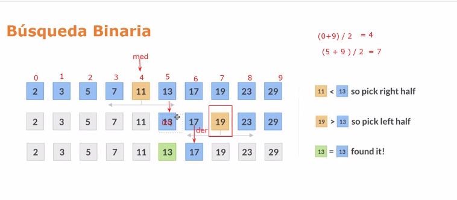

# introProgramacionUL

## Concepto de Variable

Las variables son utilizadas para referenciar (apuntar) información en memoria

La variable debe estar en un contenedor

La variable tieneun identificador para acceder a la información

Una variable puede tener valores diferentes durante el desarrollo de su programa

"Garbage collector" proceso que consiste de liberar espacios de memoria que no almacenan ninguna variable

## Concepto de variable

<variable> = <expresion>

La asignación se da de derecha a izquierda

Todo lo que captures del usuario debe ir a un contenedor o variable

La expresión podría ser una formula

Java es tipado y py es no tipado

## Tipos de datos - Definición

Variables numericos

- int: con numeros enteros
- float: condecimales

Variables alfanuméricas

- Cadenas de texto

Variables lógicas

- Con un valor booleano (true or false)

```py
a = 10
type(a)
<class = 'int'>

a = 10.5
type(a)
<class = 'float'>

a = 'luis'
type(a)
<class = 'string'>

a = 'Luis23'
type(a)
<class = 'string'>

a = True
type(a)
<class = 'bool'>
```

**Representación de algoritmos numéricos**

Utilización de constantes

- Adms de variables, un algoritmo requiere de constantes

Variables númericas - Tipo int

- Permite almacerar números enteros, esto es variables que no son fracciones ni podran serlo

Variables tipo - float

- Contienen decimal, si no tiene decimal, trabaja con int, y con decimal trabaja con float

```py
a = True or False
print(a)
True
type(a)
<class = 'bool'>

a = 'Luis'
b = 'Borjas'
print(a,b)
Luis Borjas

print(a+b)
Luisborjas
```

## Definición de algoritmo

Secuencia de instrucciones que representa la solución de un problema o situación determinada

Que consta un algoritmo??

- Entrada

  - Que se necesita para realizar los pasos

- Salida

  - Que se obtiene al final del algoritmo

- Proceso

  - De transformación, hace los pasos

- Tipos de datos
  - Números: enteros, reales, complejos
  - Texto: letras, palabras, frases
  - Otros

Características

- Preciso
- Definido
- Finito
- Debe producir un resultado

**Técnicas de representación**

- Diagramas de flujo
- Pseudocódigo
- Lenguaje natural
- Formulas matemáticas

**Diagramas**
Permite representar solución tras paso a paso de que hacer el proceso

> Insertar imagen

**Pseudocodigo**
Permite representar el algoritmo pero con palabras imperativas

Se debe representar lo que se quiere ahí

Osea verbos de acción: Inicie, calcule, lea, imprima, finalice

**Construccion**
Ejemplo

- Objetivo: calcular el precio de una manzana
- Entradas
  - Precio (en soles) del kilo de manzanas [K]
  - Peso (en gramos) promedio de una manzana [P]
- Salida
  - Precio (en soles) de una manzana [M]

```py
Inicio
    Ingresar valor de K y P
    Calcular G = K/1000
    Calcular M = G x P
    Devolver el Valor de M
Fin
```

> Insertar modo de diagrama de flujo

**Construccion de algoritmos**

Operaciones basicas
Escribir un algorimo que lea una longitud medida en pies y la convierta en metros y muestre un resultado

```js
Pies es la entrada y pies es la salida

//Entradas: Longitud en pies

//salidas: longitud en metros

//Objetivo: Convertir pies a metros

/*
Inicio
    Ingresar longitud en pies y asignar a P
    Calcular P * 0.3048 y asignar a Resultado
    Mostrar "El resultado es", Resultado
Fin
*/

Otro caso es

/*
Inicio
    Ingresar y asignar a P
    Asignar 0.3048 a Cons
    Calcular P + Cons y asignar a R
    Mostrar "El resultado es", R
Fin
*/
```

Escribir algoritmo que ingrese subtotal y tasa de gratuitidad

Entradas: Subtotal y tasa gratuidad
Salidas: Gratuidad y total
Objetivo: Calcular gratuidad y total

```
Inicio
    Ingresar subtotal (S/) y asignar a ST
    Ingresar tasa de gratuidad (%) y asignar a TG
    Calcular ST * TG y asignar a G
    Calcular ST + G y asignar a Tot
    Mostrar "Gratuidad", G
    Mostrar "Total", Tot
Fin
```

**Combinación de operaciones básicas**

```js
Inicio
    Ingresar el monto ahorrado mensual($) y asignar a ahorroConst
    Ingresar tasa efectiva anual(%) y asignar a TEA
    Calcular ((1+TEA)^(1/12)-1) y asignar a TEM
    Calcular (1 + TEM) y asignar a oTEM
    Calcular (ahorroConst*oTEM) y asignar a M1
    Calcular (ahorroConst + M1)*oTEM y asignar a M2
    Calcular (ahorroConst + M2)*oTEM y asignar a M3
    Calcular (ahorroConst + M3)*oTEM y asignar a M4
    Mostrar "Monto Mes 4", M4
Fin
```

```js
Inicio
    Ingresar Monto Mensual y asignar a Monto
    Asignar 1 + 0.00407 a Incremento
    Calcular Monto * Incremento y asignar a M1
    Calcular (Monto+M1) * Incremento y asignar a M2
    Calcular (Monto+M2) * Incremento y asignar a M3
    Calcular (Monto+M3) * Incremento y asignar a M4
    Mostrar "Monto Mes 4", M4
Fin
```

**Estructuras de Decisión**
Debes elegir si vas a un lado o vas por el otro

```py
# Esto es un comentario
"""
Esto también  es un comentario
"""
def main():
    pass
#pass hace que vayas a la sgte linea
main()
```

```py
# Esta es la plantilla de trabajo
def main():
    pass
main()
```

py no trabaja de arriba a abajo, debes avisarle cual es la función principal

ejercicio de clase:

```py
def main():
    fahren = float(input("Ingrese teperatura en Fahrenheit: "))
    # va a recibir un input y lo va a solicitar recibir como float
    celsius = (fahren - 32)*(5/9)
    print("La temperatura en celsius es: ", celsius)
    if celsius <= 17:
        print("Es un dia frío")
    if celsius > 17:
        print("Es un dia caluroso")

main()
```

Y mi opción para que te cargue con solo 2 decimales:

```py
def main():
    fahren = float(input("Ingrese teperatura en Fahrenheit: "))
    celsius = (fahren - 32)*(5/9)
    print("La temperatura en celsius es: ", '%.2f' %celsius)
    if celsius <= 17:
        print("Es un dia frío")
    if celsius > 17:
        print("Es un dia caluroso")

main()
```

La forma de poner la función principal es:

```py
if __name__ == "__main__",
    main()
```

Selectiva de decisión "Two ways"

```py
def main():
    fahren = float(input("Ingrese teperatura en Fahrenheit: "))
    # va a recibir un input y lo va a solicitar recibir como float
    celsius = (fahren - 32)*(5/9)
    print("La temperatura en celsius es: ", '%.2f' %celsius)
    if celsius <= 17:
        print("Es un dia frío")
    else:
        print("Es un dia caluroso")

main()
```

Elif es else if

EJercicios 2:

1

```js
INICIO
    Ingresar monto de pago($) y asignar a MONTO
    Si MONTO <= 100 entonces
        Mostrar "Pago con efectivo"
    Sino si MONTO > 100 y MONTO <= 300
        Mostrar "Pago con Débito"
    Sino
        Mostrar "Pago con Credito"
FIN
```

Otra solución

```js
INICIO
    Ingresar monto de pago($) y asignar a MONTO
    SI MONTO <= 100 entonces
        Mostrar "Pago con Efectivo"
    SINO
        SI MONTO > 100 y MONTO <= 300
            Mostrar "Pago con Debito"
        Sino
            Mostrar "Pago con Crédito"
FIN
```

En py

```py
def main():
  monto = float(input("Ingrese monto: "))
  # if monto <= 100:
  #   print("Pago con efectivo")
  # elif monto>100 and monto <=300:
  #   print("Pago con debito")
  # else:
  #   print("Pago con crédito")
  if monto <= 100:
    print("Pago con efectivo")
  else:
    if monto>100 and monto <=300:
      print("Pago con débito")
    else:
      print("Pago con crédito")
main()
```

2

```js
INICIO
    Ingresar dividendo y asignar a DIVIDENDO
    Ingresar divisor y asignar a DIVISOR
    Si DIVISOR es igual a 0 entonces
        Mostrar "No se puede dividir entre 0"
    SINO
        Si DIVIDENDO $ DIVISOR es igual a 0 entonces
            Mostrar "Division Exacta"
        Sino
            Mostrar "División No Exacta"

FIN
```

en py

```py
def main():
  dividendo = float(input("Ingrese el dividendo: "))
  divisor = float(input("Ingrese el divisor: "))
  if divisor == 0:
    print("No existe la división entre 0")
  else:
    result = dividendo/divisor
    print("El resultado de la división es ", result)
    if dividendo%divisor == 0:
      print("Division exacta")
    else:
      print("Division no exacta")
main()
```

4

```js
INICIO
    Ingresar año actual y asignar a Actual
    Ingresar año cualquier y asignar a X
    Calcular ACTUAL - X y asignar a DIF
    Si DIF es menor a 0
        Mostrar "Faltan", DIF, "Años"
    Sino
        Si DIFE es igual a 0 entonces
            Mostrar "Años iguales"
        Sino
            Mostrar "Han pasado", DIFE, "años"
FIN
```

Ahora en py

## Tema X

```js
c <- 1
mientras c<= 10
    imprimir "python"
    c <- c + 1
Fin de mientras
```

La flecha es la asignación

Esto imprimirá python 10 veces

```py
def main():
    c = 1
    while c<=10:
        print("python")
        c = c+1
main()
```

bloque for

while se usa cuando no sabes el limite de veces, normalmente el usuario lo decide

```py
def main():
    c = 1
    while c<=10:
        print("python")
        c = c+1
    print("Bang")
    for i in range (1,11):
        #El limite al ultimo es abierto, no llegará a 11
        #El ultimo espacio del for en py es para sumar +1, si no pones nada , asumirá que es +1
        print("Python")
main()
```

> Faltan unos cuantos ejercicios, añadir luego

```py

```

```py
def main():
  num = int(input("Ingrese un numero"))
  for i in range(1, num+1):
    for j in range ( 1, num+1):
      cantidad= (i-1)*num+j
      print(cantidad, end = "  ")
    print("")
main()
```

1 2  
3 4

Ejercicio 3

```py
def main():
  for i in range (40,60):
    if( i % 2 == 0 ):
      print(i)
main()
```

Ej 4

```py
def main():
  for i in range (48,121, +4):
    print(i)
main()
```

Ej 5

```py
def main():
  suma = 0
  for i in range(1,51):
    suma = suma + i
  print("La suma es: ", suma)
main()
```

Ej 9

```py
def main():
  num = int(input("Ingrese numero: "))
  while num < 0:
    print("Tiene que ingresar numero positivo")
    num = int(input("Ingrese numero: "))
  while num!=-1:
    if num%2==0:
      print("Ingreso un numero par")
    else:
      print("Ingrese un numero impar")
    num = int(input("ingrese otro número: "))
main()
```

```py
num=int(input("Ingrese numero: "))

    while num!=-1:
        while num<0:
            print("Tiene que ingresar numero positivo")
            num=int(input("Ingrese numero: "))

        if num%2==0:
            print("Ingreso un numero par")
        else:
            print("Ingreso un numero impar")
        num=int(input("Ingrese otro numero: "))
    print("Ingreso -1, termino el programa")
```

> Something is missing here

## Análisis de algoritmos

Queremos ahorrar tiempo y espacio(tiene o requiere)

Vas midiendo y estableciendo parametros para los algoritmos

Tipos de análisis:

- Experimental: Medir el tiempo
- Teórico: Cuanto se demoraría, imaginando o estimando cuanto tomaría o consumiría

Análisis Teórico

- Mejor caso
- Peor caso
  Predecir como se debería comportar en el mejor y en el peor caso

## Listas (Arrays)

Un conjunto de elementos relacionados

Es una secuencia ordenada de un conjunto de elementos

En py las listas son heterogeneas, le puedes meter float, string, cualquier tipo de dato, en Java en una lista primitiva, si trabajan con solo int, solo serán int sus elementos

Son dinámicas en py, pueden ir creciendo

```py
def main():
    lista = [10,20,30,40]
    suma = 0
    for i in range(0, len(lista)):
        suma = suma+lista[i]
    print(suma)
main()
```

```py
`def main():
    list = [10,20,30,40]
    count = 0
    num = int(input("Ingresar numero a buscar "))
    while count <len(list) and list[count]!=num:
        count += 1
    if count<len(list):
        print("Se encontro")
    else:
        print("No se encontró")
main()
```

Practicar métodos de arrays con: https://www.w3schools.com/python/python_ref_list.asp

## Ejercicios con Arrays

```py
def main():
  lista = []
  num = int(input("Ingresar un número, 0 para terminar: "))
  while num!= 0:
    lista.append(num)
    num = int(input("Ingresar un número, 0 para terminar: "))
  print(lista)
main()
```

recuerda el for a la izquierda es cerrado y a la derecha es abierto

```py
def main():
  lista = []
  num = int(input("Ingresar un número, 0 para terminar: "))
  while num!= 0:
    lista.append(num)
    num = int(input("Ingresar un número, 0 para terminar: "))
  print(lista)

  suma = 0
  for i in range(0,len(lista)):
    suma = suma + lista[i]
  promedio = suma / len(lista)
  print("El promedio es: ", promedio)
main()
```

otra forma

```py
def main():
  lista = []
  num = int(input("Ingresar un número, 0 para terminar: "))
  while num!= 0:
    lista.append(num)
    num = int(input("Ingresar un número, 0 para terminar: "))
  print(lista)

  suma = 0
  contador = 0
  for i in range(0,len(lista)):
    suma = suma + lista[i]
    contador = contador + 1
  promedio = suma / contador
  print("El promedio es: ", promedio)
main()
```

## Cadena

Un string, una lista de caracteres

cadena = "ABC" es un ejemplo

```py
def main():
  nombre = "ULIMA"
  for i in range(0, len(nombre)):
    print(nombre[i])
main()
```

inicio, fin, incremento/decremento

```py
def main():
  nombre = "ULIMA"
  for i in range(0, len(nombre)):
    print(nombre[i])
  nombreInver = []
  for i in range(len(nombre)-1,-1,-1):
    nombreInver.append(nombre[i])
  print(nombreInver)
main()
```

## Listas multidimensionales

Arrays que contienen a otros arrays

Recuerda la primer afila es 0,0 0,0 0,2
La segunda es 1,0 1,1 1,2

```py
def main():
  a= [[1,2,3],[4,5,6],[7,8,9]]

  for i in range (0, len(a)):
    for j in range(0, len(a[i])):
      print(a[i][j], end= " ")
    print()

main()
```

### Slicing es cortar, sacar una parte o un pedazo

```py
def main():
  a= [1,2,3,4,5,6,7,8,9]
  print(a[1:4])
main()
```

Dará 2,3,4

```py
def main():
  a= [1,2,3,4,5,6,7,8,9]
  print(a[:4])
main()
```

Dará 1,2,3,4

```py
def main():
  lista = [1,2,3]
  lista2 = []
  suma = 0
  for i in range(0, len(lista)):
    suma = suma + lista[i]
    lista2.append(suma)
  print(lista2)
main()
```

evaluando = notas.sort()
print(evaluando)

```py
def main():
  notas = [11,15,8,11,19]
  mayorNota = 0
  for i in range(0, len(notas)):
    if notas[i]>mayorNota:
      mayorNota = notas[i]
  notasLetras=[]
  for i in range(0, len(notas)):
    if notas[i]>= mayorNota - 2:
      notasLetras.append("A")
    elif notas[i]>= mayorNota - 4:
      notasLetras.append("B")
    elif notas[i]>= mayorNota - 6:
      notasLetras.append("C")
    elif notas[i]>= mayorNota - 8:
     notasLetras.append("D")
    else:
      notasLetras.append("E")
  print(notasLetras)
main()
```

## Funciones

```py
def suma(num1,num2):
  return num1+num2
  # print("La suma es ", num1+num2)
def main():
  num1= int(input("Ingrese un numero 1: "))
  num2= int(input("Ingrese un numero 2: "))

  result = suma(num1,num2)
  print("La suma es", result)
main()
```

Otra forma cambiando los parametros de suma

```py
def suma(a,b):
  return a+b
  # print("La suma es ", num1+num2)
def main():
  num1= int(input("Ingrese un numero 1: "))
  num2= int(input("Ingrese un numero 2: "))

  result = suma(num1,num2)
  print("La suma es", result)
main()
```

Ejercicio de identificar si es primo un num

```py
def esPrimo(n):
  cuentaDivisores = 2
  for i in range (2 , n):
    if n % i == 0:
      cuentaDivisores = cuentaDivisores + 1
  if cuentaDivisores > 2:
    print("n no es primo")
  else:
    print("n es primo")

def main():
  num= int(input("Ingrese un numero: "))

  esPrimo(num)
main()
```

Duc typing, tpo de objketo que solo importa el tiempo de ejecución

una funcion que junte cosas y no importa los parametros

### Ejercicios

1

```py
def maxi(num1,num2):
  if num1 > num2:
    return num1
  else:
    return num2

def main():
  num1 = int(input("Ingrese un numero 1: "))
  num2 = int(input("Ingrese un numero 2: "))

  print("El numero mayor es ", maxi(num1,num2))
main()
```

8 leer un numero capicua

```py
def invertir(n):
  a = ""
  for i in range (len(n)-1, -1, -1):
    a = a + n[i]
  return a

def esPalindromo(n):
  numInvertido = invertir(n)
  if n == numInvertido:
    print("Es palindromo")
  else:
    print("No es palindromo")

def main():
  num = str(input("Ingrese numero: "))
  print("El numero invertido es", invertir(num))
  esPalindromo(num)

main()
```

tip: cambiar n por numero

para el examen: crear 3 archivos en una carpeta examenControl2

El nombre será P1.py, P2.py, P3.py

Hacer resumen de la documentación

- while y for
- bucles anidados (for dentro de otro for)
- arrays (o listas)
- funciones

## Tupla

las tuplas son como listas per oconstantes, no puedes modificar sus elementos}

```py
tupla1 = tuple("programacion")
print(tupla1)
```

te devolveria cada uno de las letras por separado a partir de una palabra

```py
tupla2 = tuple(range(10,20))
print(tupla2)
```

Imprimira todos los elementos del 10 al 19

```py
tupla = (100,200,300)
print(tupla.indes(200))
```

te mandará el valor 200, o al menos el primer 200 que encuentre

## Diccionario

Llave y diccionario

```py
dicc = {"a":"alpha", "o":"omega", "g":"gamma"}
print(dicc[1])
```

te da error, xq ya no puedes acceder a los diccionarios por indices

sino necesitas la llave

```py
dicc = {"a":"alpha", "o":"omega", "g":"gamma"}
print(dicc["a"])
```

te dará alpha

```py
dicc = {1:"alpha", 2:"omega", 3:"gamma"}
print(dicc[1])
```

te botará alpha

```py
dicc = {"1":1,"2":2}
print(dicc.get)
```

```py
dicc = {"1":1,"2":2}
dicc.setdefault("4")
print(dicc.get("1000", "no se encontro"))
```

```py
dicc={"Peru":"Lima","Colombia":"Bogota"}
    correctas=0
    for i in dicc:
        resp=str(input("cual es la capital de " + i + " : " ))
        if dicc[i]==resp:
            correctas=correctas+1
    print("La cantidad de respuestas correctas es:",correctas)
```

## Busqueda binaria 
Va de izq a derech, la pos media es la mitad, osea de la derecha + izq / 2 = med 

Entonces vamos a mover la posicion de la izquierda hacia la derecha para acercarse al numero buscado

de nuevo buscamos el medio y luego volvemos a mover la referencia media



Si la lista se ordena previamente, no servira para recuperar la posicion original

```py
def binaria(lista, num):
  indice=-1
  izq = 0
  der = len(lista) -1 
  while izq <= der:
    med = (izq+der)//2
    if lista[med]==num:
      indice = med
      break
    else: 
      if num>lista[med]:
        izq = med +1
      else:
        der=med-1
  if indice == -1:
    print("No se encontro el numero")
  else:
    print("Se encontro en la posicion", indice)
def main():
  lista = [10,20,30,40,50,60,70,80]
  num = int(input("Ingrese el numero a buscar: "))
  binaria(lista,num)
main()
```

```py
import random

def pares(lista):
  listaPar = []
  for i in range(len(lista)):
    if lista[i]%2==0:
      listaPar.append(lista[i])
  return listaPar
def main():
  lista = []
  for i in range (100):
    lista.append(random.randint(0,9))
  print(pares(lista))
main()0
```

```py
# Escriba un programa que solicite al usuario ingresar un determinado número de pesos (valores enteros) hasta que se ingrese 0 y los almacene en una lista.
# El programa debe mostrar el promedio de los pesos ingresados y ordenar la lista (para ello puede utilizar el método sort).
# Finalmente, debe mostrar un mensaje en caso el valor 50 se encuentre en la lista. Para ello utilice el algoritmo de búsqueda binaria.

def encontrar(lista):
  indice = -1
  izq = 0
  der = len(lista) - 1
  while izq<=der:
    med=(izq+der)//2
    if lista[med]==50:
      indice=med
      break
    else:
      if 50>lista[med]:
        izq=med+1
      else:
        der=med-1
  if indice ==-1:
    print("50 no esta en la lista")
  else:
    print("50 se encontró en la posicion", indice)

def promedio(lista):
  sum = 0
  for i in range (len(lista)):
    sum = sum + lista[i]
  return sum/len(lista)

def main():
  lista = []
  n = int(input("Ingrese numero: "))
  while n!=0:
    lista.append(n)
    n = int(input("Ingrese numero: "))
  lista.sort()
  promedio(lista)
  encontrar(lista)
main()
```

```py
# 4.	Escriba un programa en Python que genere 300 números aleatorios entre 2 y 3000. Debe ingresar a una lista aquellos v alores sean primos y ordenar la lista de mayor a menor utilizando el método sort().
# Finalmente, muestre cuantos números de la lista son mayores que 100 utilizando búsqueda secuencial.
import random

def primo(num):
    divisores=2
    for i in range(2,num):
        if num%i==0:
            divisores=divisores+1
            break
    if divisores==2:
        return True
    else:
        return False

def mayores100(lista):
    conta=0
    for i in range(len(lista)):
        if lista[i]>100:
            conta=conta+1
    return conta        

def main():
    lista=[]
    for i in range(300):
        num=random.randint(2, 3000)
        if primo(num):
            lista.append(num)
    lista.sort(reverse=True)
    print("Los valores mayores a 100 son: ",mayores100(lista))
            
main()

```

## Lista de ordenamiento 

### Algoritmo de burbuja
```py
def burbuja(lista):
    aux = 0
    for i in range(0,len(lista)-1):
        # no necesitas ya la ultima linea 
        for j in range (i+1, len(lista)):
            if lista[i] > lista[j]:
                aux = lista[i]
                lista[i] = lista[j]
                lista[j] = aux
    return lista

def main():
    lista = [9,11,2,4,6,14,30,20]
    print("La lista ordenada es: ", burbuja(lista))
main()
```

Y para mayor a menor
```py
def burbuja(lista):
    aux = 0
    for i in range(0,len(lista)-1):
        # no necesitas ya la ultima linea 
        for j in range (i+1, len(lista)):
            if lista[i] < lista[j]:
                aux = lista[i]
                lista[i] = lista[j]
                lista[j] = aux
    return lista

def main():
    lista = [9,11,2,4,6,14,30,20]
    print("La lista ordenada es: ", burbuja(lista))
main()
```

### Quick sort
Recursividad
Caso base:
  Tamaño <= 1
  Retorna Lista 

Parte recursiva:
  

Tomamos un pivot como 9, de lista de los mayores y lista de menores
Y otra ves ordenarmeos estas listas 

Retyorna 
  Lista Me + Lista Ig + Lista Ma

Esto se repite hasta que el tamaño sea igual al caso base 

```py
def quicksort(lista):
    if len(lista)<=1:
        return lista
    else:
        listaMa = []
        listaMe = []
        listaIg = []
        pivot = lista[0]
        for i in range(0, len(lista)):
            if lista[i]>pivot:
                listaMa.append(lista[i])
            elif lista[i]<pivot:
                listaMe.append(lista[i])
            else:
                listaIg.append(lista[i])
        listaMa = quicksort(listaMa)
        listaMe = quicksort(listaMe)
        return listaMe + listaIg + listaMa

def main():
    lista = [9,11,2,4,6,14,30,20]
    print("La lista ordenada es: ", quicksort(lista))
main()
```

2.	Implemente un programa que genere 100 números aleatorios (entre 0 y 9) y los ingrese a una lista. Posteriormente, ordene los valores e ingrese los primeros 50 en una nueva lista. Utilice el ordenamiento de burbuja.
```py
from random import random
import random
def burbuja(lista):
    aux = 0
    for i in range(0,len(lista)-1):
        for j in range(i+1,len(lista)):
            if lista[i] > lista[j]:
                aux = lista[i]
                lista[i] = lista[j]
                lista[j] = aux
    return lista
def main():
    list = []
    for i in range (0,101):
        n = random.randint(0,9)
        list.append(n)
    print(burbuja(list))
    lista2 = list[:50]
    print(lista2)
main()
```


3.	Implemente un programa que solicite al usuario ingresar un determinado número de pesos (valores enteros) hasta que se ingrese 0, calcule el promedio de valores, agregue dicho valor al final de la lista y finalmente ordene dicha lista. Utilice el ordenamiento Quicksort.
```py

```
https://www.reddit.com/r/programming/comments/ercgjr/why_is_quicksort_better_than_other_sorting/
https://www.reddit.com/r/learnprogramming/comments/2oya8k/why_would_you_use_bubble_sort_or_linear_search/